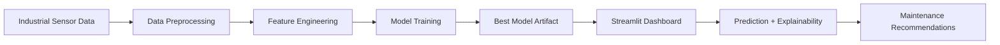

# 🏭 Industrial Predictive Maintenance System

   

A premium AI-powered platform for predicting machine failures, monitoring operational health, and recommending maintenance actions using industrial sensor data.

## ✨ Features
- Predict equipment failure probability in real time
- Interactive Streamlit dashboard with multiple operational views
- Explainable AI using SHAP feature importance
- Maintenance recommendations tailored to risk level
- PDF report generation for predictions
- Authentication-ready deployment for production environments
- Cloud deployment support for Streamlit Community Cloud

## 📸 Screenshots
- Overview dashboard with KPI cards and live insights
- Data analysis page with failure distribution and correlations
- Model performance page with evaluation metrics and SHAP rankings
- Prediction page for scenario-based machine health analysis
- Machine health dashboard with risk and maintenance guidance


> 
> 


## 🏗️ Architecture Diagram



## 📊 Dataset Information
This project uses the AI4I 2020 Predictive Maintenance Dataset, which includes features such as:
- Air temperature
- Process temperature
- Rotational speed
- Torque
- Tool wear
- Product type
- Machine failure target label

If the official CSV is missing, the app automatically generates a synthetic AI4I-style dataset for local testing and demo mode.

## 🧠 Machine Learning Pipeline
1. Load and clean industrial sensor data
2. Engineer categorical and numeric features
3. Train multiple classifiers such as Logistic Regression, Random Forest, and XGBoost
4. Compare model performance using accuracy, precision, recall, F1 score, and ROC-AUC
5. Persist the best model to models/best_model.pkl
6. Serve predictions through the dashboard with explainability and recommendations

## 🖥️ Dashboard Preview
The dashboard includes:
- Project overview with operational KPIs
- Data analysis and trend visualization
- Model evaluation and SHAP insights
- Failure prediction form
- Machine health scoring and action guidance

## 🚀 Installation Guide
### Local Setup
```bash
git clone <your-repo-url>
cd industrial_predictive_maintenance
python -m venv .venv
source .venv/bin/activate  # On Windows use .venv\Scripts\activate
pip install -r requirements.txt
streamlit run app.py
```

### Streamlit Cloud Deployment
1. Push this repository to GitHub
2. Create a new app in Streamlit Community Cloud
3. Select the repository and set the main file to app.py
4. Add secrets for authentication if needed
5. Deploy and verify the app

## ☁️ Deployment Guide

### 1. GitHub Repository
1. Create a new GitHub repository.
2. Push the project files including:
   - app.py
   - requirements.txt
   - .streamlit/config.toml
   - .streamlit/secrets.toml
   - src/
   - models/best_model.pkl
   - data/
3. Ensure the repository is public or private based on your hosting choice.
4. Commit and push the latest changes.

### 2. Streamlit Cloud
1. Open Streamlit Community Cloud.
2. Click New app.
3. Connect your GitHub repository.
4. Set the app main file to app.py.
5. Choose the branch and repository root.
6. Add environment variables or secrets if needed:
   - APP_USERNAME
   - APP_PASSWORD
7. Click Deploy.

### 3. Render
1. Create a new Web Service on Render.
2. Connect the GitHub repository.
3. Set the build command:
   ```bash
   pip install -r requirements.txt
   ```
4. Set the start command:
   ```bash
   streamlit run app.py --server.headless true --server.port $PORT
   ```
5. Add environment variables if required.
6. Deploy the service.

### 4. Railway
1. Create a new Railway project.
2. Connect the GitHub repository.
3. Add a Python service.
4. Set the build command:
   ```bash
   pip install -r requirements.txt
   ```
5. Set the start command:
   ```bash
   streamlit run app.py --server.headless true --server.port $PORT
   ```
6. Add environment variables for authentication secrets.
7. Deploy the app.

### Required Files
- app.py
- requirements.txt
- .streamlit/config.toml
- .streamlit/secrets.toml
- src/
- models/best_model.pkl
- data/

### Environment Setup
Use the following for local and cloud environments:
```bash
python -m venv .venv
source .venv/bin/activate
pip install -r requirements.txt
```

### Common Errors and Fixes
- Error: ModuleNotFoundError for reportlab or streamlit
  - Fix: install dependencies again with pip install -r requirements.txt
- Error: Port binding issue
  - Fix: use --server.port $PORT on cloud hosts and set host to 0.0.0.0
- Error: Model file missing
  - Fix: ensure models/best_model.pkl exists or allow the app to fall back to demo mode
- Error: Authentication failure
  - Fix: set APP_USERNAME and APP_PASSWORD correctly in secrets or environment variables
- Error: App hangs on startup
  - Fix: verify the repository structure and confirm app.py is the correct entrypoint

### Deployment Checklist
- [ ] Repository uploaded to GitHub
- [ ] requirements.txt includes all dependencies
- [ ] app.py is the entry point
- [ ] .streamlit/config.toml exists
- [ ] model file exists in models/best_model.pkl
- [ ] secrets or environment variables configured
- [ ] app launches successfully locally
- [ ] cloud deployment URL opens without errors

For production, replace the default credentials with your own secure values.

## 🔮 Future Enhancements
- Real-time IoT ingestion and streaming analytics
- Integration with databases and alerting systems
- Advanced anomaly detection and drift monitoring
- Multi-asset fleet management dashboards
- Automated retraining pipelines

## 👤 Author
Built by Akshat Kumar

## 📬 Contact
- Email: akshayjadiya15@gmail.com
- GitHub: https://github.com/akshayjadiya15
- LinkedIn: [https://www.linkedin.com/in/your-profile](https://www.linkedin.com/in/akshayjadiya15/)
